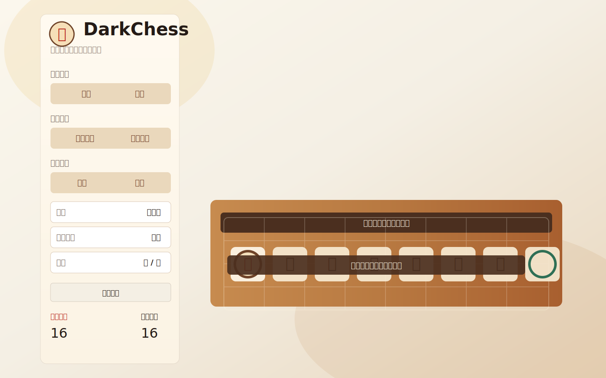

# DarkChess

DarkChess 是一個以 Vue 3 製作的暗棋小遊戲，主打快速開局、清楚的對局回饋與簡潔俐落的介面。專案支援雙人對戰與人機對戰，提供棋盤樣式、棋子主題、難度調整、被吃棋子區與結束結果視窗等功能，讓你可以用更輕量的方式體驗完整暗棋對局。

## 線上展示

- GitHub Pages 入口：`page/index.html`
- 本機主入口：`index.html`

## 版本重點

- 介面切分為 `遊戲` 與 `設定` 兩個視圖，操作更直覺
- 新增左右兩側的被吃棋子區，對局資訊更容易一眼掌握
- 重新調整桌面與手機版版面，讓棋盤在不同螢幕上都更好閱讀
- 提供翻棋與吃子動畫，回合變化更有節奏感
- 新增結束對話框，勝負結果與重開操作更清楚
- 電腦回合加入可取消的延遲排程，切換狀態時更穩定
- 人機模式支援 `簡單`、`普通`、`困難` 三種難度
- 可切換 `基本棋盤`、`木質棋盤`、`傳統`、`貓咪` 等視覺主題
- 首翻後自動決定紅黑陣營，減少開局操作成本
- 使用內建 AI 處理電腦回合，並依難度調整策略選擇

## 畫面預覽



## 遊戲特色

- 8 x 4 暗棋棋盤
- 雙人與人機兩種對戰模式
- 即時顯示目前回合、先手結果、陣營分配與剩餘棋子數
- 被吃棋子會獨立集中顯示，方便回顧局勢
- 遊戲結束時會顯示勝負結果視窗，方便快速重新開始
- 可自由切換棋盤與棋子樣式
- 暗棋基本規則完整支援：
  - 未翻開的棋子可先翻面
  - 已翻開且屬於自己陣營的棋子可以移動
  - 可攻擊上下左右相鄰的敵方棋子
  - 炮可隔一子直線攻擊
  - 兵、卒可吃將、帥
  - 將、帥不可吃兵、卒

## 規則摘要

- 棋盤規格為 `8 x 4`
- 每方共有 `16` 顆棋子，合計 `32` 顆
- 紅黑棋子會在首翻後才決定分配給玩家或電腦
- 雙人模式由玩家一先手；人機模式則會隨機決定玩家或電腦先手
- 每回合只能進行一個動作：
  - 翻開一顆未揭示棋子
  - 移動一顆已揭示且屬於自己陣營的棋子
  - 吃掉可合法攻擊的敵方棋子
- 一般棋子只能上下左右移動一格
- 一般棋子吃子時也只能攻擊上下左右相鄰的敵方棋子
- 炮的移動規則：
  - 沒有隔子時，可直線移到相鄰空格
  - 直線上若剛好隔一顆棋子，則可吃第二顆棋子
  - 炮不能以一般方式直接吃相鄰棋子
- 任何一方的棋子被全部吃光時，遊戲結束
- 若某一方沒有任何合法動作，另一方直接獲勝
- 人機模式中，電腦會在自己的回合自動思考並行動
- 電腦思考會先延遲短暫時間，避免連續切換時出現殘留回合動作

## 操作方式

1. 選擇遊戲模式。
2. 若是人機模式，可再選擇電腦難度。
3. 依需求切換棋盤樣式與棋子樣式。
4. 按下 `開始遊戲`。
5. 依照畫面提示進行翻棋、移動與吃子。

## 快速上手

- 想先看展示頁，直接開啟 `page/index.html`
- 想在本機測試，直接開啟 `index.html`
- 若瀏覽器阻擋本機檔案載入，可以改用靜態伺服器
- 第一次體驗建議先從 `普通` 難度開始，再切到 `困難` 測試 AI 風格

## 專案結構

- `index.html`：本機主畫面與 UI 結構
- `page/index.html`：GitHub Pages 展示入口
- `app.js`：遊戲邏輯、AI、規則判定與狀態管理
- `style.css`：整體視覺樣式與響應式版面
- `assets/pieces/cat/`：貓咪主題棋子圖檔
- `docs/screenshot.svg`：README 使用的畫面示意圖

## 執行方式

這是純前端靜態專案，沒有額外建置步驟。

### 方式一：直接開啟本機頁面

在瀏覽器中開啟 `index.html` 即可。

### 方式二：查看 GitHub Pages 展示頁

直接開啟 `page/index.html` 觀看發佈版入口。

### 方式三：使用靜態伺服器

如果你的瀏覽器對本機檔案載入有限制，可以用任意靜態伺服器開啟專案目錄，例如：

```bash
npx serve
```

或是使用 VS Code Live Server。

## 技術棧

- Vue 3
- Bootstrap 5
- 原生 JavaScript
- CSS

## 備註

- 專案目前透過 CDN 載入 Vue 與 Bootstrap
- 預設棋子主題為 `貓咪`
- 若想切回傳統樣式，可在設定面板中切換棋子主題
- 人機模式的 AI 會根據難度做基本策略選擇，包含翻棋、吃子與風險評估
- README 的畫面示意圖會隨介面更新持續調整
